# WEB1999

Relive the glory days of yesteryear with `WEB1999`: a simulation of the Web
browsing experience circa the turn of the third millennium in the palm of your
hand on your TI-82 Advanced, TI-83 Premium CE, or TI-84+ CE calculator!

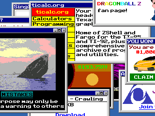

`WEB1999` is a non-interactive screensaver-style program inspired by [Rob
Manuel's "Realistic Internet
Simulator"](https://www2.b3ta.com/realistic-internet-simulator/) (first
published in 2002), where assorted pop-up advertisements appear onscreen and the
player's goal is to close them. This program adapts and extends the concept to
commemorate recognizable aspects of the Web experience between the years 1999
and 2001 (rather than only including a few generic "spammy" pop-up styles as in
the original) and automates the activity of moving the cursor and interacting
with windows so the "game" effectively plays itself.

To match the experience of the "Realistic Internet Simulator," viewers are
encouraged to hum the tune of Wagner's "Ride of the Valkyries" while observing
`WEB1999` in action.

## Use

`WEB1999` runs on Texas Instruments "CE" graphing calculators only- ones with
color screens, an eZ80 processor and support for running machine code. At the
time of writing, this includes the TI-84 Plus CE(-T), TI-83 Premium CE and
the Python variants of each. For calculators with OS version 5.5.1 or later,
[arTIfiCE](https://yvantt.github.io/arTIfiCE/) is required.

As with any other assembly program, transfer `WEB1999.8xp` to a calculator using
a tool such as TI Connect CE or [ticalc.link](https://ticalc.link/), then launch
the program from the `PRGM` menu or using [your favorite
shell](https://github.com/mateoconlechuga/cesium/releases/latest). A copy of the
[C libraries](https://github.com/CE-Programming/libraries/releases/latest)
must also be present on the calculator, but the program will display a message
if the required libraries are missing.

After starting the program, press any key to exit.

## License

`WEB1999` is © 2023 Peter Marheine, provided under the terms of a 2-clause BSD
license which grants permission to make unlimited copies of it as long as credit
is given to the original author. Some of the image assets included are provided
under a different license that forbids commercial use. See the included
[LICENSE](LICENSE.txt) file for details.

## Compiling

This program was developed with version 11.2 of the CE tools available from
<https://github.com/CE-Programming/toolchain/releases/tag/v11.2>. Refer to
its [Getting
Started](https://ce-programming.github.io/toolchain/static/getting-started.html)
documentation for setup instructions.

Running `make gfx all` should be sufficient to build `WEB1999.8xp`, after
setting up the toolchain.  For testing some visual aspects of the program, `make
testvis` will instead build the program `W9TESTV` which steps through different
window kinds via the left and right arrow keys.

## Design notes

The visual design and choices of pop-up window contents are intended to
reproduce the feel of various web pages and advertisements that were in
existence around the year 2000, as they might have been experienced on a
home computer of the era. No single item is a precise copy of any real web page,
but the designs are built for reasonable verisimilitude to the era.

### Desktop

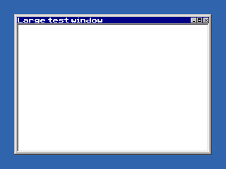

Window decorations and background color are based on the default styles of
Windows 95, 98, and Me which remained available as the "Classic Theme" in later
versions until Windows 8 removed it as a standard option.

### Color palette

For efficiency reasons, most programs for CE calculators use a 256-color
paletteized display mode that allows display of up to 256 colors from among the
approximately 32768 colors that can be represented by the screen. This coincides
nicely with the same palette-size limitation that applied to many mid-90s PCs,
for which web designers often limited themselves to a 216-color "web-safe"
palette.

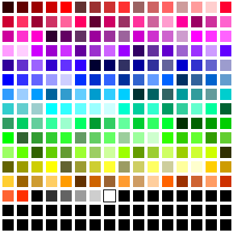

`WEB1999` limits itself only to the basic 216-color web-safe palette plus the
16-color "Windows VGA" palette included in the [HTML 3.2
specification](https://www.w3.org/TR/2018/SPSD-html32-20180315/#colors) which
assigns each of those colors a standard human-readable name. A very small number
of additional colors are included as "system" colors which are used to display
the window decorations.

### Singles near you!

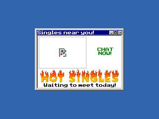

In 2023 as in 1999, untrustworthy advertisements for "adult" services are not
uncommon, especially on web pages with questionably-legal topics. This pop-up
attempts to entice the viewer with an image that fails to load correctly but
presumably would be of a titillating nature, encouraging them to use an
unspecified service to contact "hot singles" for activities which are
circumspectly described as "chatting."

The placeholder icon used to represent an image that failed to load correctly in
this window is the one used by Netscape Navigator, which by 1999 was probably
still in use in some places but was rapidly being displaced by Microsoft's
Internet Explorer (IE). IE used an icon containing a small red 'x' symbol
instead, so this window uses the Netscape icon because it is more visually
interesting and iconic.

The text "HOT SINGLES" is styled to appear as if the text is on fire,
accentuating the assertion that the claimed singles are hot. This style of text
decoration is reminiscent of
[WordArt](https://web.archive.org/web/20201217153950/https://twitter.com/natbro/status/1339596104208244738),
a feature of Microsoft Office since the early 1990s that was often used by
people looking to add additional flavor to otherwise unremarkable blocks of
text and has seen greatly reduced application since the 90s.

### Dragonball Oasis

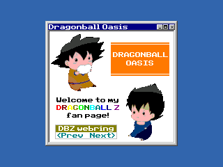

Dragonball Oasis is inspired by early anime fansites of the sort that
proliferated on free web hosts like
[GeoCities](https://en.wikipedia.org/wiki/GeoCities). This fake fansite borrows
the name from a real Dragon Ball Z fansite that existed at
[geocities.com/animedg/](http://web.archive.org/web/20091026233603/http://geocities.com/animedg/);
though that name wasn't used until sometime later than 2001, it seems broadly
representative of the approach many fansites of this kind would have used toward
naming.

Dragon Ball Z reached broad English-speaking popularity at least as early as
1999, and that popularity continued for years. Given its large fanbase, a Dragon
Ball fansite seems highly representative of what eager young fans might have
been doing with their time around 1999.

The rainbow-colored text used to write "Dragonball Z" here reflects how many
enthusiastic amateurs of the sort who would create anime fansites like this one
would often have more technical ability than good sense in regard to legibility,
choosing to use highly-stylized text or apply various effects that make things
more difficult to read but are more eye-catching. Other examples of this pattern
are the (non-standard and long-deprecated) HTML `blink` and `marquee` tags.

This site also appears to be part of a Dragon Ball-related webring. Webrings
were common in the mid-90s when search engines tended to be unreliable or slow:
a "ringmaster" would organize a ring that acted like a directory of sites with
similar topics, and users could traverse the ring to discover new sites with
the same subject matter.

### Despair

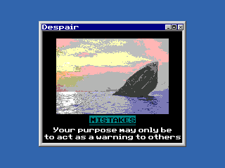

This is an adaptation of [Despair Inc's
"Mistakes"](https://despair.com/products/mistakes) demotivational poster. This
particular design was on sale via Despair's web site at least as early as
April 1999. Despair's products generally parody Successories' motivational
posters, and in turn Despair's "Demotivators" later spawned the "demotivational
poster" genre of Internet memes.

### LimeWire

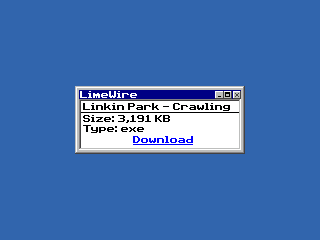

A dialog seeming to provide a link to download a .exe file of about 4 megabytes
in size which seemingly purports to be a copy of Linkin Park's song "Crawling,"
first released in October 2000. The window title "LimeWire" refers to the
peer-to-peer application of the same name first released in May of that year
which was widely used to illegally share pirated music.

On close inspection, savvy viewers will notice that a .exe file probably does
not contain music and is instead a program meant to run on a Windows computer:
this reflects that peer-to-peer networks often (historically and still in 2023)
contain items that purport to be something that a user might want to download
but that are actually malware of some kind.

In the 1999-2001 period it's likely that Internet users engaged in media piracy
would have used Napster instead (which reached its peak in early 2001 and was
forced to cease operations only a few months later), but it seems that malware
would have been relatively rare on the Napster network.  Later, LimeWire in
particular was shown to be particularly hazardous: PC Pro magazine's September
2008 issue found that around 30% of files randomly sampled from the LimeWire
network contained malware.

### Strong Bad Sings

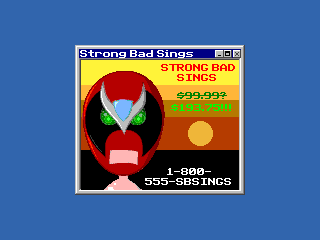

This pop-up is an adaptation of the web cartoon "[Strong Bad
Sings](https://homestarrunner.com/toons/strong-bad-sings)", published sometime
in 2000 on the Homestar Runner website. Homestar Runner was (and is) a site
featuring cartoons created by Mike and Matt Chapman that was first put online
early in 2000 which reached [significant popularity and public awareness by
2006](https://web.archive.org/web/20060920150232/http://www.wired.com/news/culture/0,59261-2.html?tw=wn_story_page_next2).

Although *Strong Bad Sings* itself was online in 2000, it probably wasn't
well-known at the time. However, it is included in `WEB1999` for several
reasons:

 * The character of Strong Bad is recognizable to many people who were online
   around that time (even if that awareness came later).
 * Homestar Runner as a site effectively represents the common use of
   Macromedia's (later Adobe) Flash platform for multimedia web content until
   the time came for it to be displaced by standardized technologies
   (exemplified by HTML5) beginning around 2007.
 * The use of *Strong Bad Sings* in particular for a pop-up ad makes for
   a good meta-joke wherein the parody of an advertisement is treated like an
   actual advertisement.

### Got milk?

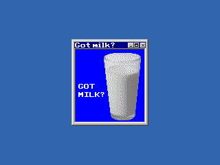

The slogan "Got Milk?" was created in 1993 as the core of an advertising
campaign funded by milk processors intended to encourage consumption of milk
products. It achieved extremely high consumer awareness (with more than 90%
of consumers being aware of it in the United States according to the campaign's
managers) and was often used in milk advertising until 2014, after that
continuing to appear but in more limited scope.

### America Online

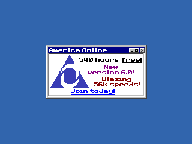

America Online (AOL) was one of the largest online service providers beginning
in the early 90s and lasting in that form until 2009. They became notorious for
direct marketing in which they sent disks (first floppy disks, [later
CDs](https://archive.org/details/aolcds)) to
potential subscribers which promised generous free trials to new users.
At one time, [50% of global CD production was AOL
CDs](https://techcrunch.com/2010/12/27/aol-discs-90s/)!

The promotional CDs
often included prominent numbers like "1175 hours free!", with fine print
noting that the offered free connection time was over some limited period.
In the example of 1175 hours (nearly 49 days), that limit was 50 days so
getting maximum value out of that free trial would involve tying up a phone
line for weeks on end. The ubiquity of AOL discs eventually led to broad
antipathy among the public especially with regard to the [perceived
wastefulness](https://web.archive.org/web/20030423062842/http://www.cbc.ca/consumers/market/files/home/aol_discs/)
of manufacturing and shipping millions of unwanted CDs.

### YOU WON!

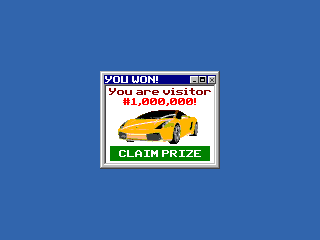

Dubious claims of a user being the one millionth visitor to a given web page (or
some other large, round number) were a common entrypoint for scams seeking to
collect personal information from unsuspecting Web users. This one seems to
imply that the user has won a car.

It's also reminiscent of hit counters that were found on some web pages
throughout the 1990s (especially those run by individuals) that incremented a
user-visible counter on the page for every page load. A scam like this might
have been more appealing to its victims at the time when hit counters were
relatively common, compared to their effectively complete disappearance
after the turn of the millennium.

### What droid?

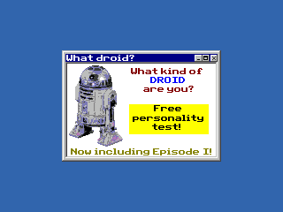

This encouragement for the user to take some kind of personality test is
representative of a perennial kind of Web sludge proffering pseudo-psychological
evaluations that are popular with users and can easily be used to collect user
information for purposes of later advertising (such as sending them spam
emails).

The Star Wars theme for this popup (referring to droids and featuring an image
of R2-D2) points to *Episode I - The Phantom Menace* which was
released in theaters in May of 1999 amid huge public interest. The specific
concept for a personality test to answer the question of what kind of droid a
person might be was inspired by a poll on the front page of starwars.com
[as of August 15,
2000](https://web.archive.org/web/20000815212952/http://starwars.com/) which
asked what kind of droid the site's readers most needed.

### ALL YOUR BASE

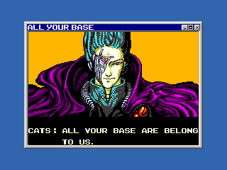

A screen image from the 1989 video game *Zero Wing*, which had a notoriously
poor English translation from the original Japanese. Versions of this screen as
a meme [first appeared on some message boards in late
1998](https://web.archive.org/web/20010602111141/http://hubert.retrogames.com/article.php?sid=1),
and by early 2001 it had become big enough to gain attention from traditional
media outlets. The phrase "all your base are belong to us" remains a well-known
meme as of 2023.

### ticalc.org

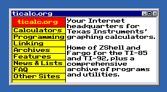

This is a simplified version of the ticalc.org homepage
[circa 1999](https://web.archive.org/web/19990208010548/http://ticalc.org/).
As of late 2023, ticalc still uses the same basic visual design that was
introduced in early 2000, so it seemed important to take an older version
to make it visually distinct from the modern version of the site.

ticalc.org remains an important TI programming community hub in 2023, although
its importance seems to have been on a downward trend over recent years; this
window acknowledges its long history.

### Safe to turn off your computer

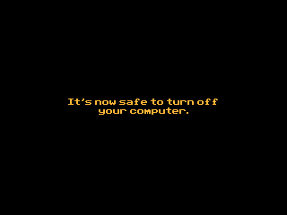

This screen is not a pop-up window, and is only displayed in specific cases.
This text was shown by Windows 95 (possibly later versions as well) on computers
that [lacked the ability to power off under software
control](https://devblogs.microsoft.com/oldnewthing/20160419-00/?p=93315).
Although by 1999 it seems likely that most computers would have been able to
power off through software commands, this screen enhances the feeling of using a
Windows 95 or 98 PC.

Advanced Power Management (APM) specified the earliest standard way to control
computer power in software, appearing in 1992 and being fairly well-supported by
1996 (when ["version 1.0" of APM support was added to
Linux](https://git.kernel.org/pub/scm/linux/kernel/git/stable/linux.git/tree/arch/x86/kernel/apm_32.c?h=v6.6.1#n17)).
The Advanced Configuration and Power Interface (ACPI) was specified late in 1996
and was supported by Windows 98, but even in late 1998 [ACPI was still
considered fairly unreliable on some
systems](https://web.archive.org/web/19991013055230/http://winmag.com/library/1998/1201/cov0066.htm).
Near-universal adoption of ACPI probably didn't come until around 2004 when most
Linux 2.6-based distributions [enabled ACPI support by
default](https://www.kernel.org/doc/ols/2004/ols2004v1-pages-121-132.pdf). Given
these, it seems likely that a typical home computer around 1999 would have
supported at least power-off by APM and possibly ACPI but this screen is
included despite that because it's more fun.
